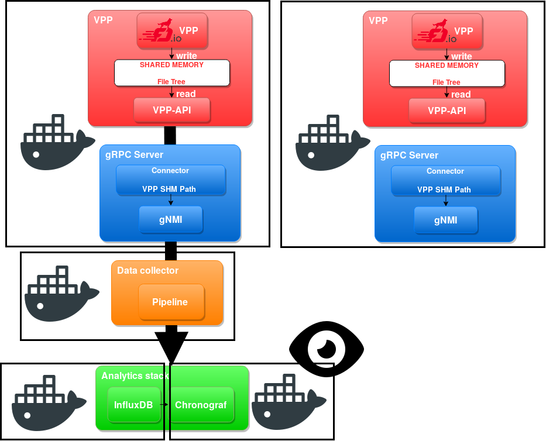

# VPP Telemetry scenario

This scenario uses:

* 2 VPP instance built on ubuntu bionic with grpcpp 1.12.0 and honeycomb to configure;
* 1 pipeline-gnmi instance built on alpine 3.8 collecting data from gNMI server
* 1 Influxdb instance to store telemetry informations received from pipeline
* 1 Chronograf instance to visualize telemetry informations, use dashboard, ...

VPP (Vector Packet Processing) is a highly-scalable open-source dataplane (see [What is VPP?](https://wiki.fd.io/view/VPP/What_is_VPP%3F)).

Honeycomb is a Java-based management agent that allows configuration of VPP using NETCONF / RESTCONF. ([see Honeycomb](https://wiki.fd.io/view/Honeycomb)).

Pipeline-gnmi is a data collector which uses gNMI and based on ([pipeline for IOS-XR](https://github.com/cisco/bigmuddy-network-telemetry-pipeline). ([see pipeline-gnmi](https://github.com/cisco-ie/pipeline-gnmi)).

Influxdb is a Time Serie DataBase from TICK stack used to store metrics with timestamps. ([see InfluxDB](https://www.influxdata.com/time-series-platform/influxdb/)).

Chronograf is a web interface from TICK stack which can be used to see graphs. ([see Chronograf](https://www.influxdata.com/time-series-platform/chronograf/)).

The intended docker architecture is:



## 0. Requirements

In order to run this scenario, you need:

* a working version of __docker__;
* a working version of __docker-compose__;
* a UNIX shell;
* an internet connection to fetch images.

## 1. Short version: Running everything automatically

You can create containers and configure the different instances using this:

```
docker-compose up
./configure-docker.sh
```

Then you can see chronograf : [http://localhost:8888](http://localhost:8888)

## 2. Long version: configuration details

So first you can start by creating the containers with:

```
docker-compose up
```

### 2.1 Choosing VPP interfaces

In order to get non-zero counters for VPP instances, we need to configure the network on vpp1 and vpp2.

VPP can use both __hardware interfaces__ (PCI interfaces) and __software interfaces__. Hardware interfaces are used with VMs or hosts only, they are named  _GigabitEthernetX/Y/Z_ or _TenGigabitEthernetX/Y/Z_.

It supports three types of virtual interfaces:

* __host/AF_PACKETS interfaces__ ([See VPP host interfaces](https://wiki.fd.io/view/VPP/Configure_VPP_As_A_Router_Between_Namespaces))
* __tap interfaces__ ([See VPP tap](https://wiki.fd.io/view/VPP/Configure_VPP_TAP_Interfaces_For_Container_Routing))
* __memif interfaces__ ([See memif interfaces](https://fdio-vpp.readthedocs.io/en/latest/gettingstarted/progressivevpp/twovppinstances.html))

#### host/AF_PACKET interfaces

Host or AF_PACKET interfaces are based on efficient AF_PACKET shared memory with kernel.
They are named _host-<iface>_.

Virtual Ethernet interfaces always come in pairs and work like a tube.

1. Container must have an interface of type veth peered with host-vpp0
2. VPP creates interface vpp0 as member of the veth pair vethns0 `vppctl create host-interface name vpp0`.

```
+--------------------+          +-------------------+
| Container0         |          | VPP               |
|                    |          |                   |
|             +------+   veth   +-----------+       |
|             | vpp0 +----------+ host-vpp0 |       |
|             +------+          +-----------+       |
|                    |          |                   |
+--------------------+          +-------------------+
```

#### Tap interfaces

VPP is able to dynamically create linux tap interfaces. They are named _tapX_.

#### Memif interfaces

memif is a very high performance, direct memory interface type which can be used between FD.io VPP instances. It uses a file socket for a control channel to set up shared memory.

### 2.2 Configuring VPP host interfaces with honeycomb

We will use Honeycomb which leverages japi (VPP Java API).

Honeycomb exposes two network configuration options: RESTCONF and NETCONF.  
In this scenario we have decide to use __host interfaces__.

When we have created the containers with docker-compose, an interface named eth0 of type veth has been created. VPP will bind its host interface _host-eth0_ to the veth pair.

```
docker-compose exec vpp1 curl -k -u admin:admin \
    -X POST -H "Content-Type: application/yang.data+json" \
    -d '{"interface": [{
      "name": "host-eth0",
      "type": "v3po:af-packet",
      "v3po:af-packet": {"host-interface-name": "eth0", "mac": "00:00:00:00:12:10"},
      "ietf-ip:ipv6": {"address": [{"ip": "fd12::10", "prefix-length": 64}]}
    }]}' https://localhost:8445/restconf/config/ietf-interfaces:interfaces
```

### 2.3 Perform network operations

We can run a basic ICMP from vpp2 to vpp1 to see the evolution of counters: _/if/rx_ and _/if/tx_.

```
docker-compose exec vpp2 vppctl ping fd12::10
```

### 2.4 Check data in Influxdb

This step is not necessary because Cronograf can be used to see metrics stored. This can be used however for people who would like to use metrics for statistics.

Use Influx client to print timestamp: `./influx`
Use Influx client to print timestamp in RFC3339 format: `./influx --precision rfc3339`

You can run the following command to see how data are organized in influxdb:

```
> connect localhost:8086
> show databases
> use telemetry
> show measurement -- 
> show series -- output differents producers for a measurement
> select "/measurement1/if/rx/host-eth0/T0/bytes" from "/measurement1" limit 5 -- Perform a query on a measurement
```

### 2.5 Configuring Cronograf dashboard

The easiest way to create a dashboard with its associated graphs is to do it graphically and export the configuration in JSON in a file.

1. Get all dashboard and get the dashboard number you are interested in:
```
curl -X GET http://localhost:8888/chronograf/v1/dashboards | python -m json.tool
```

2. Get dashboard configuration
```
curl -X GET http://localhost:8888/chronograf/v1/dashboards/4 | python -m json.tool > RX_TX_dashboard.json
```

Then, you can import this graph on Cronograph with:

```
curl -i -X POST -H "Content-Type: application/json" \
  http://localhost:8888/chronograf/v1/dashboards -d @RX_TX_dashboard.json
```

Then, check [http://localhost:8888](http://localhost:8888)
